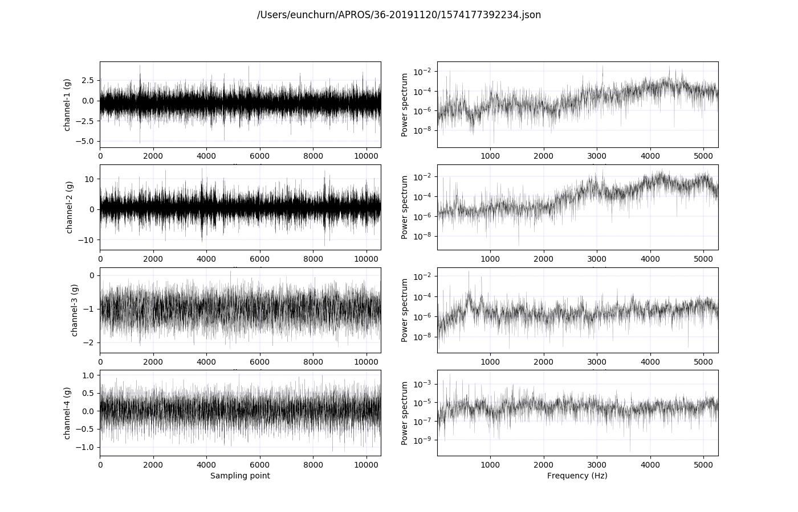
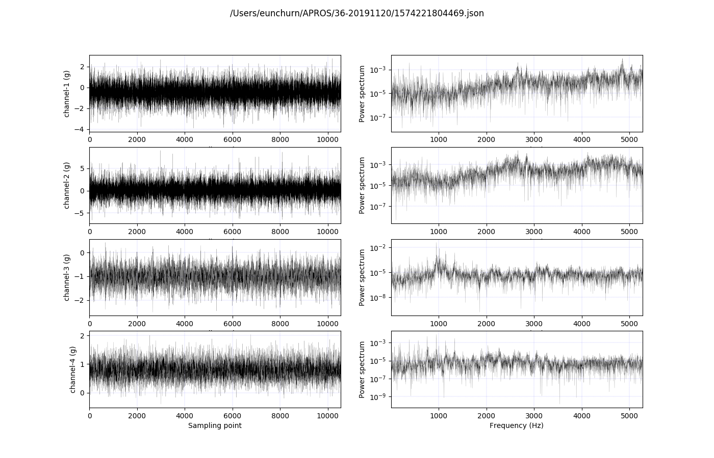

# Raw Data file (JSON) to Image (PNG)

[](https://github.com/eunchurn/data-spectrum-image/actions) [](https://travis-ci.org/eunchurn/data-spectrum-image)

Raw 4 channel acceleration data plot to Time domain, Frequency domain (Power spectral density)

## Requirements

- [Python 3.7](https://www.python.org/downloads/release/python-374/)

## Installation

```bash
pip install -r requirements.txt
```

### Dependencies

- [`scipy`](https://scipy.org/)
- [`matplotlib`](https://matplotlib.org/)

## Configuration

### 데이터 폴더 지정

- `main.py`을 열고 JSON 데이터 경로 수정
- Windows의 경우 `C:\\Users\\eunchurn\\APROS\\36-20191120` 방식으로 수정

```python
# JSON 데이터 폴더 지정
json_path = '/Users/eunchurn/APROS/36-20191120'
```

### 출력 폴더 지정

- `main.py`열고 출력 폴더 지정
- Windows의 경우 `C:\\Users\\eunchurn\\APROS\\36-2019112\png` 방식으로 수정

```python
# PNG 출력 저장할 폴더 지정
output_path = '/Users/eunchurn/APROS/36-20191120/png'
```

## Run script

```python
python main.py
```

## Result

Result will be in `output_path` as `png` files.



